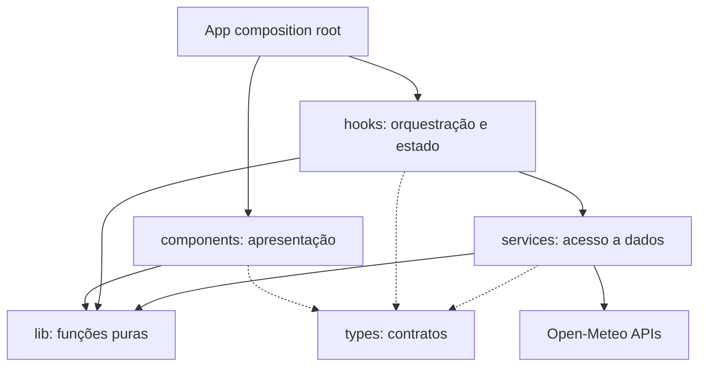
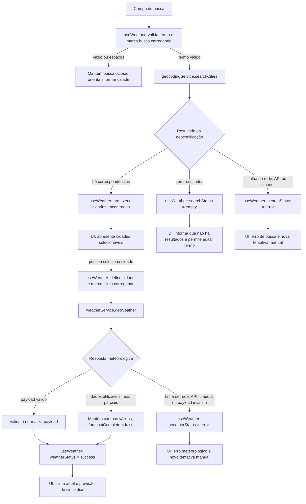

# Plano Técnico: Weather App

Este plano deriva de [`specs/weather-app-spec.md`](../specs/weather-app-spec.md). Os IDs FR, AC, US e NFR são mantidos como rastreabilidade para decomposição de tarefas e testes. Este documento define arquitetura e contratos; não implementa o produto.

## Architecture

Aplicação client-side React organizada em quatro camadas, com `types/` como contratos compartilhados e `App.tsx` como ponto de composição. Não há backend próprio, autenticação, banco de dados ou estado global externo.



- `components/` renderiza dados e coleta ações; não chama APIs nem mantém regras de domínio.
- `hooks/` coordena pesquisa, seleção, estados da tela, retry manual e descarte de respostas obsoletas; não monta URLs nem interpreta payloads da Open-Meteo.
- `services/` executa `fetch`, timeout, validação e normalização dos payloads externos para os contratos do domínio.
- `lib/` contém funções puras sem React, rede ou estado global: conversão de unidade, mapeamento de códigos WMO, validações e formatação de datas.
- `types/` declara tipos de domínio compartilhados; não contém comportamento.

Direção permitida: `App → components/hooks`, `components → lib/types`, `hooks → services/lib/types` e `services → lib/types`. `lib` e `types` não dependem de React nem de `services`; `components` não importa `hooks` ou `services` diretamente. Essa regra mantém efeitos colaterais em uma fronteira única e permite testar cada camada com substitutos simples.

Cada chamada remota tem timeout de 10 segundos. A resposta de uma seleção anterior não pode sobrescrever a seleção mais recente. O domínio mantém temperaturas em Celsius; a unidade de exibição é aplicada na apresentação.

## Tech Stack

| Área | Escolha | Justificativa |
|---|---|---|
| Linguagem | TypeScript strict | Tipar contratos externos e estados de carregamento/erro. |
| UI | React 19 + Vite | Stack já instalada e configurada no repositório. |
| Estilo | Tailwind CSS | Convenção do projeto; preservar tema dark glassmorphism existente. |
| HTTP | `fetch` nativo | Duas APIs REST simples não justificam cliente adicional. |
| Testes unitários | Vitest + Testing Library + user-event | Dependências e scripts existentes; cobrem funções, hooks e interação acessível. |
| Testes E2E | Playwright | Já configurado no projeto para os fluxos de aceite. |
| Lint e formatação | Biome | Ferramenta e scripts existentes no repositório. |
| Pacotes | pnpm | Gerenciador definido no projeto. |

Não adicionar biblioteca de estado, cliente HTTP, roteador ou camada de cache para este MVP.

## Project Structure

```text
src/
  App.tsx
  components/
    SearchForm.tsx
    CityResults.tsx
    CurrentWeather.tsx
    ForecastList.tsx
    WeatherStatus.tsx
  hooks/
    useWeather.ts
  services/
    geocodingService.ts
    weatherService.ts
  lib/
    temperature.ts
    weatherCodes.ts
    format.ts
    searchQuery.ts
  types/
    weather.ts
tests/
  unit/
  e2e/
```

`App.tsx` compõe os componentes e conecta `useWeather`. Manter um componente por arquivo; cada componente recebe dados e callbacks por props. Os testes unitários podem espelhar os módulos em `tests/unit/`; os E2E exercitam a aplicação por `tests/e2e/`, seguindo a configuração existente.

Essa divisão facilita testes porque:

- `lib/` é verificada com testes unitários determinísticos, sem DOM, rede ou mocks de React.
- `services/` é testada isoladamente com `fetch` mockado, cobrindo URL, timeout, payload válido, erro e resposta parcial.
- `hooks/` é testado com serviços substituídos, verificando transições de estado, retry manual e descarte de respostas antigas.
- `components/` é testado com Testing Library, dados e callbacks controlados, focando semântica, teclado e estados apresentados.
- E2E cobre poucos fluxos críticos com APIs interceptadas, sem dependência da disponibilidade externa.

## Data Model

Tipos abaixo são contratos de domínio, não modelos das respostas HTTP. Serviços convertem e validam os payloads externos antes de entregá-los à interface.

```ts
export type Unit = "celsius" | "fahrenheit";

export interface City {
  /** Identificador numérico retornado pela API de geocodificação. */
  id: number;
  /** Nome da cidade retornado pela busca. */
  name: string;
  /** Região administrativa de primeiro nível, quando disponível. */
  admin1: string | null;
  /** País do resultado, quando disponível. */
  country: string | null;
  /** Latitude usada na consulta meteorológica. */
  latitude: number;
  /** Longitude usada na consulta meteorológica. */
  longitude: number;
}

export interface CurrentWeather {
  /** Temperatura atual normalizada para Celsius; null quando ausente ou inválida. */
  temperatureC: number | null;
  /** Código WMO da condição atual; null quando ausente ou inválido. */
  weatherCode: number | null;
  /** Horário da observação ISO 8601; null quando ausente ou inválido. */
  observedAt: string | null;
  /** Umidade relativa em porcentagem; null quando ausente ou inválida. */
  humidityPercent: number | null;
  /** Velocidade do vento em km/h; null quando ausente ou inválida. */
  windSpeedKmh: number | null;
  /** Precipitação em milímetros; null quando ausente ou inválida. */
  precipitationMm: number | null;
  /** Pressão à superfície em hPa; null quando ausente ou inválida. */
  pressureHpa: number | null;
}

export interface ForecastDay {
  /** Data local da previsão no formato YYYY-MM-DD. */
  date: string;
  /** Código WMO da condição diária; null quando ausente ou inválido. */
  weatherCode: number | null;
  /** Temperatura mínima diária normalizada para Celsius. */
  temperatureMinC: number | null;
  /** Temperatura máxima diária normalizada para Celsius. */
  temperatureMaxC: number | null;
  /** Probabilidade máxima de precipitação do dia em porcentagem. */
  precipitationProbabilityPercent: number | null;
}

export interface WeatherData {
  /** Cidade selecionada para a consulta. */
  city: City;
  /** Fuso IANA retornado pela API meteorológica, por exemplo, America/Sao_Paulo. */
  timezone: string;
  /** Observação meteorológica atual da cidade. */
  current: CurrentWeather;
  /** Dias de previsão retornados, em ordem cronológica. */
  forecast: ForecastDay[];
  /** Indica se há cinco dias consecutivos completos para hoje e os quatro dias seguintes. */
  forecastComplete: boolean;
}
```

Regras dos contratos:

- `City.id` usa o identificador retornado pela geocodificação; lat/lon são usados na consulta meteorológica.
- Valores meteorológicos ausentes ou inválidos são `null`, nunca `0` nem valores inferidos.
- `weatherCode` guarda o código WMO original; descrição e ícone são produzidos por `lib/weatherCodes.ts`. Código não mapeado resulta em “Condição indisponível” e ícone de fallback.
- `observedAt` é um timestamp ISO da fonte; a interface o formata no `timezone` retornado pela API meteorológica.
- `forecast` contém apenas datas e campos válidos. `forecastComplete` só é `true` quando há exatamente cinco datas consecutivas de hoje até hoje + 4, com condição, mínima, máxima e probabilidade de precipitação válidas em cada dia.
- Datas diárias permanecem como `YYYY-MM-DD` até a formatação, evitando conversão acidental de dia por timezone do navegador.

Contrato de estado para o hook:

```ts
export type RequestStatus = "idle" | "loading" | "success" | "error" | "empty";
export type WeatherStatus = Exclude<RequestStatus, "empty">;
export type RequestErrorCode = "network" | "api" | "timeout" | "invalid-response";

export interface WeatherViewState {
  searchStatus: RequestStatus;
  weatherStatus: WeatherStatus;
  query: string;
  cities: City[];
  selectedCity: City | null;
  weather: WeatherData | null;
  unit: Unit;
  searchError: RequestErrorCode | null;
  weatherError: RequestErrorCode | null;
}
```

`empty` aplica-se à busca sem resultados. Uma resposta meteorológica parcial permanece em `success` quando contém dados utilizáveis; `forecastComplete=false` e campos `null` identificam a incompletude. Se a resposta não contiver nenhum dado utilizável, usar `error` com `invalid-response`.

## Data Flow



1. A pessoa envia o formulário. O hook rejeita input vazio após trim de espaços externos; não altera acentos, pontuação ou espaços internos.
2. O hook marca `searchStatus=loading`, cancela ou invalida busca anterior e chama `searchCities(query)`.
3. O serviço de geocodificação valida o status HTTP e o JSON. Zero resultados definem `searchStatus=empty`; erro técnico define `error`.
4. A UI lista os resultados com contexto geográfico disponível. Selecionar uma cidade define `selectedCity` e limpa dados pertencentes à seleção anterior.
5. O hook chama `getWeather(city)` com latitude/longitude, usando Celsius na API e timezone automático. Uma resposta antiga ou de cidade diferente é descartada.
6. O serviço normaliza clima atual, timezone e previsão diária. Campos inválidos viram `null`; dias válidos são mantidos na ordem da data.
7. O hook define `weatherStatus=success` para payload utilizável, mesmo incompleto; `forecastComplete` e campos nulos controlam o estado de conteúdo. Se nenhum dado puder ser usado, define `error`.
8. A UI deriva cada valor de exibição a partir dos valores canônicos em Celsius e de `unit` durante o render, usando uma função pura de `lib/temperature.ts`. Alterar `unit` atualiza somente estado local e renderização; não chama serviços nem dispara efeitos de rede.
9. Retry é iniciado somente pela ação explícita da pessoa; cada clique produz uma única chamada.

## External APIs

Sem chave de API, conforme a decisão da spec. `geocodingService` e `weatherService` encapsulam URLs, transporte, validação e conversão dos payloads externos para os tipos do Data Model. Exemplos abaixo são resumidos e ilustrativos; os serviços devem tolerar campos adicionais da API.

### Geocoding

- **URL base:** `https://geocoding-api.open-meteo.com/v1/search`
- **Exemplo de chamada:** `https://geocoding-api.open-meteo.com/v1/search?name=S%C3%A3o%20Paulo&count=10&language=pt&format=json`
- **Parâmetros:** `name` é o texto pesquisado; `count=10` limita a lista; `language=pt` solicita nomes em português quando disponíveis; `format=json` solicita JSON.
- **Exemplo resumido de resposta:**

```json
{
  "results": [
    {
      "id": 3448439,
      "name": "São Paulo",
      "latitude": -23.55,
      "longitude": -46.63,
      "admin1": "São Paulo",
      "country": "Brasil"
    }
  ],
  "generationtime_ms": 0.2
}
```

- **Mapeamento para `City`:** `id` → `id`; `name` → `name`; `admin1` → `admin1`; `country` → `country`; `latitude` → `latitude`; `longitude` → `longitude`. Campos de contexto ausentes são normalizados para `null`; resultados sem identificador ou coordenadas válidos são descartados como inválidos.
- **Sem resultados:** resposta sem `results` ou com lista vazia é estado `empty`, não falha da API. O serviço não chama forecast até que uma cidade seja selecionada.
- O limite de dez opções é uma escolha de integração para o MVP; resultados permanecem selecionáveis e mostram o contexto disponível.

### Forecast

- **URL base:** `https://api.open-meteo.com/v1/forecast`
- **Exemplo de chamada:** `https://api.open-meteo.com/v1/forecast?latitude=-23.55&longitude=-46.63&current=temperature_2m%2Cweather_code%2Crelative_humidity_2m%2Cwind_speed_10m%2Cprecipitation%2Csurface_pressure&daily=weather_code%2Ctemperature_2m_max%2Ctemperature_2m_min%2Cprecipitation_probability_max&temperature_unit=celsius&wind_speed_unit=kmh&timezone=auto&forecast_days=5`
- **Parâmetros:** `latitude` e `longitude` vêm da cidade selecionada; `current=temperature_2m,weather_code,relative_humidity_2m,wind_speed_10m,precipitation,surface_pressure` solicita as medidas atuais; `daily=weather_code,temperature_2m_max,temperature_2m_min,precipitation_probability_max` solicita condição, temperaturas mínima/máxima e probabilidade máxima diária de precipitação; `temperature_unit=celsius` fixa Celsius como unidade canônica; `wind_speed_unit=kmh` fixa vento em km/h; `timezone=auto` solicita o fuso da coordenada; `forecast_days=5` solicita hoje e os quatro dias seguintes.
- **Exemplo resumido de resposta:**

```json
{
  "timezone": "America/Sao_Paulo",
  "current": {
    "time": "2026-09-30T14:00",
    "temperature_2m": 23.4,
    "weather_code": 3,
    "relative_humidity_2m": 62,
    "wind_speed_10m": 14.2,
    "precipitation": 0.0,
    "surface_pressure": 1013.2
  },
  "daily": {
    "time": ["2026-09-30", "2026-10-01"],
    "weather_code": [3, 2],
    "temperature_2m_max": [27.1, 26.5],
    "temperature_2m_min": [18.2, 17.9],
    "precipitation_probability_max": [10, 20]
  }
}
```

  A resposta real deve conter até cinco elementos diários; o exemplo mostra dois para manter o payload curto.
- **Mapeamento para `WeatherData`:** a `City` selecionada é preservada como `city`; `timezone` → `timezone`; `current.temperature_2m` → `current.temperatureC`; `current.weather_code` → `current.weatherCode`; `current.time` → `current.observedAt`; `current.relative_humidity_2m` → `current.humidityPercent`; `current.wind_speed_10m` → `current.windSpeedKmh`; `current.precipitation` → `current.precipitationMm`; `current.surface_pressure` → `current.pressureHpa`.
- **Mapeamento para `ForecastDay`:** para cada índice `i` de `daily.time`, criar `date` com `daily.time[i]`, `weatherCode` com `daily.weather_code[i]`, `temperatureMaxC` com `daily.temperature_2m_max[i]`, `temperatureMinC` com `daily.temperature_2m_min[i]` e `precipitationProbabilityPercent` com `daily.precipitation_probability_max[i]`. Os arrays são associados pelo índice, nunca por ordenação independente.
- `forecastComplete` é `true` somente quando há cinco datas consecutivas, hoje até hoje + 4 no fuso retornado, e condição, mínima, máxima e probabilidade de precipitação válidas em cada dia; caso contrário, dados válidos podem ser apresentados como parciais conforme AC-08.
- Validar `response.ok`, JSON, unidades solicitadas, timezone, timestamps, tipos numéricos finitos e comprimentos correspondentes dos arrays antes de criar `WeatherData`. Temperaturas permanecem em Celsius no modelo; conversão para Fahrenheit é feita pela função de apresentação, conforme AC-10.
- Exibir a atribuição exigida pelo provedor e confirmar limites/termos antes do release (NFR-08, Open Question 1).

## State Management

- O estado da aplicação vive em `useWeather`, chamado por `App`; não usar Redux, Context ou persistência.
- Pesquisa e consulta meteorológica mantêm status independentes, cada um com `idle`, `loading`, `success`, `error` ou `empty`. `empty` é usado somente para pesquisa sem resultados; estado inicial é `idle`.
- `useWeather` mantém query, resultados, cidade selecionada, dados meteorológicos e unidade. O termo permanece editável em resultado vazio e erro.
- A unidade começa em Celsius e existe somente em memória durante o carregamento atual da aplicação.
- `WeatherData` guarda todas as temperaturas em Celsius. Os componentes chamam função pura de apresentação durante o render para converter e arredondar conforme `unit`; valores convertidos não são armazenados no estado.
- Alternar Celsius/Fahrenheit atualiza `unit` e causa novo render apenas. Não dispara `useEffect`, chamada de service ou request à Open-Meteo.
- Services recebem `AbortSignal`; o hook invalida requests anteriores por cancelamento ou identificador de requisição, impedindo que respostas obsoletas alterem o estado atual.

## Error Handling

| Situação | Estado | Comportamento esperado |
|---|---|---|
| Estado inicial | `idle` | Não mostra erro nem faz request até a pessoa enviar uma pesquisa ou selecionar uma cidade. |
| Input vazio ou whitespace | Sem chamada; busca permanece `idle` | Orientar a informar uma cidade e manter campo editável. |
| Geocoding sem resultados | `empty` | Informar ausência de resultados, manter termo e não chamar forecast. |
| Request pendente | `loading` | Comunicar progresso e não atribuir dados antigos à nova cidade. |
| Falha de rede | `error` + `network` | Informar falha de conexão; manter seleção/query e oferecer retry manual. |
| HTTP não-2xx ou erro retornado pela API | `error` + `api` | Informar indisponibilidade do serviço; não apresentar payload como dado meteorológico. |
| Timeout de 10 s | `error` + `timeout` | Abortar request, encerrar loading, informar timeout e oferecer retry manual. |
| JSON inválido ou schema sem dados utilizáveis | `error` + `invalid-response` | Informar que os dados vieram inválidos; não mostrar valores inferidos e oferecer retry manual. |
| Campo ou dia parcial com dados utilizáveis | `success` e campos `null`; `forecastComplete=false` quando aplicável | Mostrar os campos válidos, identificar “Previsão incompleta” quando faltar cobertura diária e não inferir valores. |
| Condição WMO não mapeada | `success` com fallback | Mostrar “Condição indisponível” e preservar os demais campos válidos. |
| Nova seleção durante request | Request anterior invalidado | Só a seleção mais recente pode atualizar a tela. |

Mensagens são em pt-BR e não expõem stack traces, URLs internas ou detalhes brutos da resposta. Erros são recuperáveis por retry manual, sem retry automático. Código de erro e texto de apresentação permanecem separados para não acoplar a UI à mensagem do serviço.

## Testing Strategy

- **Unitários (Vitest):** busca vazia e preservação de caracteres; normalização de payloads e métricas atuais; códigos WMO conhecidos/desconhecidos; rótulos dos dias e formatação `DD/MM/AAAA`; conversão nos dois sentidos, uma casa decimal e empates; validação de resposta parcial e probabilidade de precipitação.
- **Serviços (Vitest):** respostas válidas, zero resultados, HTTP não-OK, JSON inválido, campos ausentes, timeout em 10 s e cancelamento/descarte de resposta obsoleta. Mockar `fetch`, sem depender da rede real.
- **Componentes/hooks (Testing Library):** envio de pesquisa, escolha de cidade, estados idle/loading/success/error/empty, sucesso com forecast parcial, retry manual, atualização de unidade sem request e uso por teclado com labels/roles.
- **E2E (Playwright):** cobrir US-01 a US-06 e AC-01 a AC-17 com respostas de API interceptadas; verificar as viewports 390 × 844 e 1280 × 800, ausência de overflow horizontal e seleção mais recente.
- **Acessibilidade:** testes automatizados complementam, não substituem, verificação manual WCAG 2.2 AA para teclado, foco, contraste e anúncios de estado (NFR-02).
- **Desempenho:** executar 100 medições bem-sucedidas por fluxo sob as condições do NFR-01; validar P95 ≤ 3 s para geocoding e ≤ 5 s para consulta meteorológica.
- **Gate de entrega:** `pnpm lint`, `pnpm build`, `pnpm test` e `pnpm test:e2e`.

## Risks & Trade-offs

| Risco ou trade-off | Consequência | Decisão/mitigação |
|---|---|---|
| Indisponibilidade, limite ou mudança da Open-Meteo | Busca ou previsão pode falhar e o contrato pode mudar. | Isolar endpoints nos services, validar payload e termos; não publicar antes de validar Open Question 1. |
| Mapeamento de códigos meteorológicos | Código sem descrição aprovada reduz compreensão. | Mapear códigos WMO em utilitário puro e usar fallback; validar traduções como gate de release. |
| Sem cache/offline | Consultas exigem rede e repetição pode gerar latência. | Aceitar no MVP para evitar complexidade e risco de dado desatualizado. |
| Conversão local em vez de pedir unidade à API | Mantém um modelo canônico e evita respostas duplicadas. | Armazenar em Celsius e testar conversão bidirecional e arredondamento. |
| Limite de dez resultados de geocoding | Uma cidade relevante pode não estar na lista de opções. | Usar contexto geográfico; revisar o limite se testes de usuário mostrarem insuficiência. |
| Requisitos externos ainda não aprovados | Metas ou termos podem alterar a implementação e o release. | Aprovar limites de desempenho/navegadores e confirmar termos e atribuição antes de ship. |
